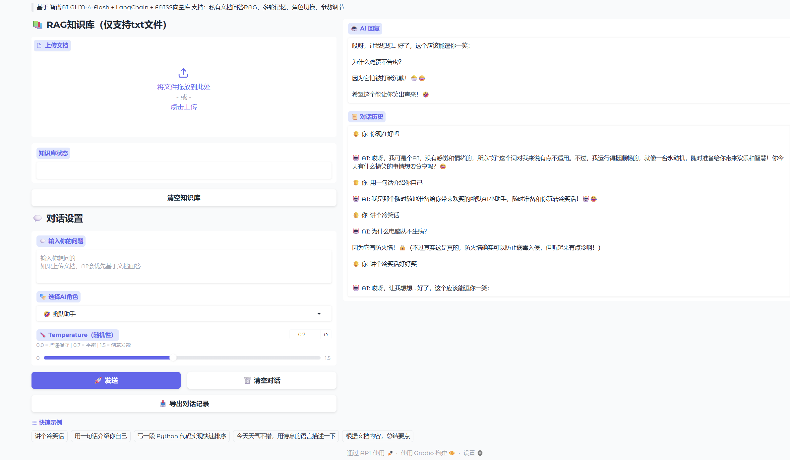

# AI-实践-实验室
大模型应用开发练习项目，基于LangChain调用智谱GLM-4-Flash API，搭建Web智能对话助手。

## ✨ 项目功能
- 可视化Web网页交互界面
- 对接智谱大模型API，实现问答对话
- 轻量化，本地一键启动

## 🛠️ 技术栈
Python、LangChain、智谱AI SDK、Gradio

## 🚀 本地运行
1. 安装依赖
```bash
pip install -r requirements.txt
配置智谱 AI API 密钥
