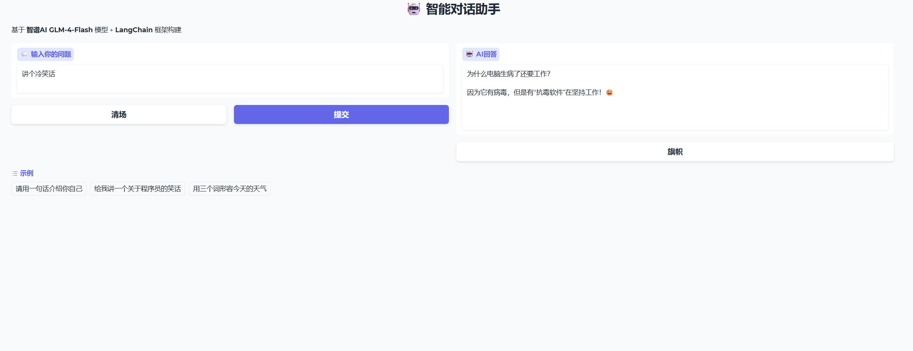

# ai-practice-lab

大模型应用开发练习仓库，包含 LangChain 调用智谱AI API 的命令行和 Web 界面版本。

## 🖥️ 项目演示

## 📁 项目文件

| 文件 | 说明 |
|---|---|
| `ai.py` | 命令行版本，LangChain + 智谱AI 基础调用 |
| `app.py` | Web界面版本，基于 Gradio 搭建 |
| `requirements.txt` | Python 依赖清单 |

## 🛠️ 技术栈

- Python
- LangChain
- 智谱AI GLM-4-Flash
- Gradio
- Prompt Engineering

## 🚀 如何运行

1. 安装依赖：`pip install -r requirements.txt`
2. 在 `.env` 文件中配置 `ZHIPUAI_API_KEY`
3. 运行 Web 界面：`python app.py`
4. 浏览器打开 `http://127.0.0.1:7860`
